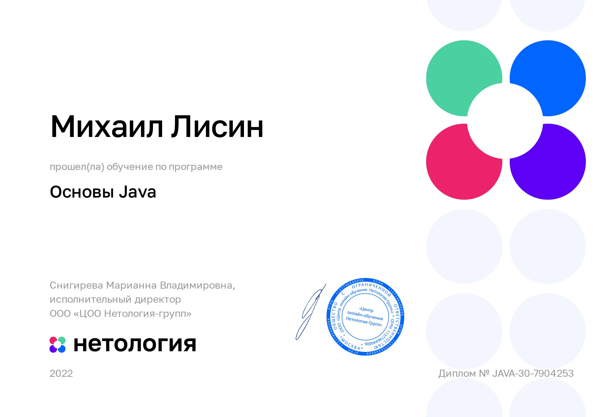
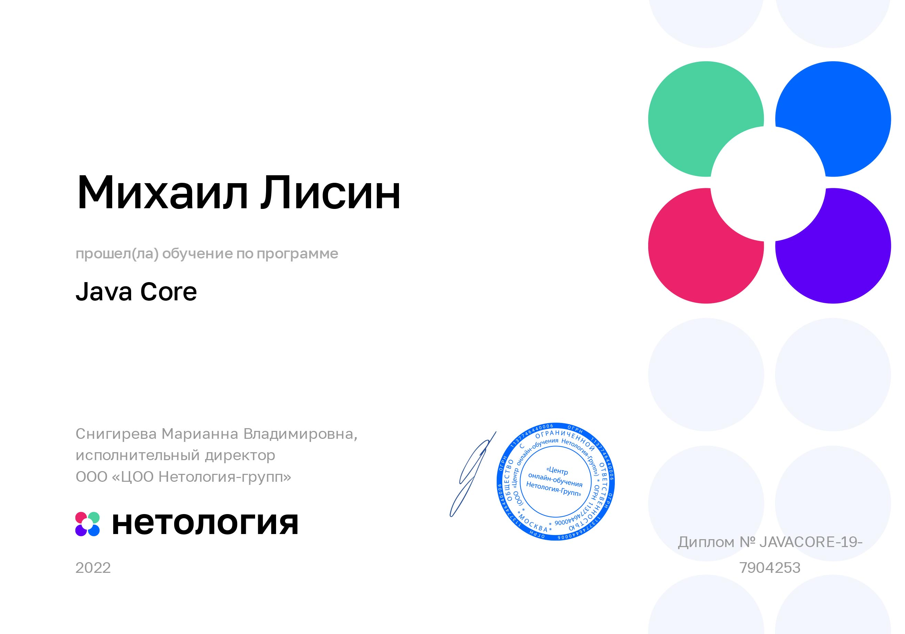
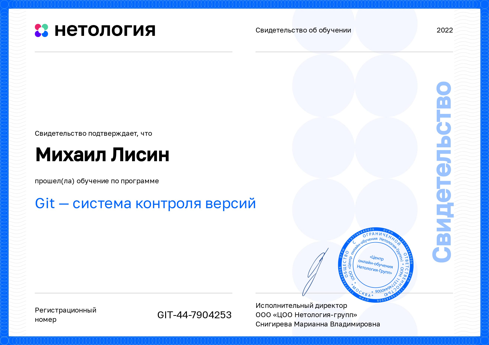

| | |
|---|:---|
| | ***Здравствуйте! Приветствую Вас на моей страничке! Меня зовут Михаил Лисин, я начинающий JavaDeveloper. Заканчиваю курс от Нетолигии "Java-разработчик"***

### [***Сертификаты***](#Сертификаты)
### ***Cписок выполненых мной работ:***
### ***Решение тестовых задачи от одной из самых крупных компаний в России (задачи с ограничением времени и памяти)***

[1. Отгадай слово](https://github.com/MsLFox/YandexTests/tree/master/Test1/src) -   `byte[]`, `BufferedReader`, `FileReader`

[2. Поздравляю, вы прошли](https://github.com/MsLFox/YandexTests/tree/master/Test2/src) - `HashMap`, `ArrayList`, `String[]`, `Stream API`, `Comporator`, `Comparable`,`BufferedReader`, `FileReader`, 

[3. Ориентация в лабиринте(рекурсия)](https://github.com/MsLFox/YandexTests/tree/master/Test4/src) - `рекурсия`, `BufferedReader`, `FileReader`

[4. В шаге от идеала (скобочная последовательность с индексом)](https://github.com/MsLFox/YandexTests/tree/master/Test5/src) - `Stack`, `FileReader`

### ***Задания от Нетологии***
**Synchronized блоки. Использованы** `wait`, `notify`, `sleep`, `lock`.
- [Автосалон](https://github.com/MsLFox/Synchronization.git)
- [Продвинутый Автосалон](https://github.com/MsLFox/Synchronization.git)
**Переменные многопоточной программы.** `ThreadLocal. Atomics. Volatile`
- [Игра. Самая бесполезная коробка](https://github.com/MsLFox/ThreadLocal.Atomics.Volatile.git)
- [Отчет для налоговой](https://github.com/MsLFox/ThreadLocal.Atomics.Volatile.git)
**Коллекции для параллельной (конкурирующей) работы**
- [Колл- центр используя `ConcurrentLinkedQueue`](https://github.com/MsLFox/ConcurrentCollectionsTask1.git)
- [Сравнение `ConcurrentHashMap` vs `HashMap Collections.synchronizedMap`](https://github.com/MsLFox/ConcurrentCollectionsTask2.git)

**Клиент-серверное взаимодействие.** `Blocking и Non-Blocking IO.`
- [Blocking IO](https://github.com/MsLFox/ClientServerTask1.git)
- [Non-Blocking IO](https://github.com/MsLFox/ClientServerTask2.git)

### ***Сертификаты***

| | |
|---|---|
|||
|||
|||

